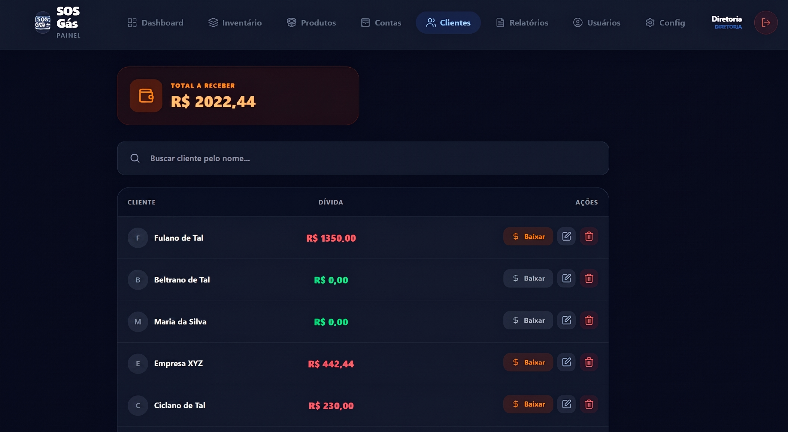

# SOS Gás 🚚 - ERP de Logística e Gestão de Revenda

> Maximizando o controle logístico de estoque, logística reversa de vasilhames e gestão financeira diária.


---

## 🎯 Visão Geral

O **SOS Gás** é um ERP customizado focado nas dores reais de revendas de gás e água. O sistema resolve a complexidade da logística reversa de vasilhames, perdas no rastreamento de botijões vazios e a gestão fragmentada de recebimentos. Através de um controle rigoroso de caixa diário ("Daily Closing") e automação de contas a pagar atreladas à compra de estoque, a plataforma centraliza a operação e estanca vazamentos financeiros.

## 📷 Telas do Projeto

*(Adicione aqui os prints das principais telas do seu sistema. Seguem algumas sugestões de organização:)*

### Dashboard e Fechamento de Caixa
<div align="center">
  
</div>

<div align="center">
  
</div>

### Controle de Estoque e Logística Reversa
<div align="center">
  
</div>

<div align="center">
  
</div>

### Gestão de Contas de Clientes
<div align="center">
  
</div>

---

## ✅ Principais Funcionalidades

- [x] **Fechamento de Caixa Diário:** Processo automatizado que concilia estoque inicial/final e calcula as vendas reais por método de pagamento (Pix, Dinheiro, Cartão).
- [x] **Controle de Logística Reversa:** Rastreamento unificado de estoque "cheio" (pronto para venda) e "vazio" (vasilhame), essencial para reabastecimento junto às distribuidoras.
- [x] **Gestão de Carteira "Fiado" (Conta Cliente):** Criação de saldo devedor associado a perfis de clientes, permitindo vendas a prazo com acompanhamento preciso e cobrança estruturada.
- [x] **Split Payment:** O sistema suporta pagamentos fracionados nativamente na mesma transação (ex: metade em dinheiro, metade no PIX).
- [x] **Automação de Contas a Pagar (Bills):** Entradas de estoque no sistema (invoices/boletos) geram automaticamente provisões financeiras no módulo de Contas a Pagar.

## 🛠️ Tecnologias e Arquitetura

O sistema foi arquitetado para garantir integridade transacional e alta confiabilidade nos dados financeiros:

- **Frontend:** Next.js (App Router), TailwindCSS, Sonner (Toasts de UI), Heroicons
- **Backend:** Next.js Server Actions, NextAuth.js (v4) com Bcrypt
- **Infraestrutura/DB:** PostgreSQL (via Supabase), Prisma ORM

### Boas Práticas e Design de Software
- **Integridade Financeira:** Utilização de `onDelete: Cascade` mapeada do Prisma na entidade `Bill` atrelada a uma `Transaction` para prevenir orfanato de dados financeiros, mantendo o balanço sempre íntegro.
- **Enum-Driven Design:** Tipos de transação (Entrada/Saída), unidades e perfis foram rigorosamente extraídos para Enums no banco, forçando restrições diretamente na camada de dados e minimizando bugs de input por parte do usuário.

---

## 🚀 Como Executar Localmente

**Pré-requisitos:** Node.js (versão LTS) e Git instalados.

```bash
# 1. Clone o repositório
git clone [https://github.com/SEU_USUARIO/sos-gas.git](https://github.com/SEU_USUARIO/sos-gas.git)

# 2. Acesse o diretório
cd sos-gas

# 3. Instale as dependências
npm install

# 4. Configuração do Ambiente
# Crie o arquivo .env baseado no exemplo abaixo:
# DATABASE_URL="sua_url_do_postgres_com_pgbouncer"
# DIRECT_URL="sua_url_do_postgres_direta"
# NEXTAUTH_SECRET="seu_secret_seguro"
# NEXT_PUBLIC_APP_URL="http://localhost:3000"

# 5. Configure o Prisma e o Banco de Dados
npx prisma generate
npx prisma db push

# 6. (Opcional) Popule o banco com dados iniciais
npm run prisma db seed

# 7. Rode a aplicação
npm run dev
